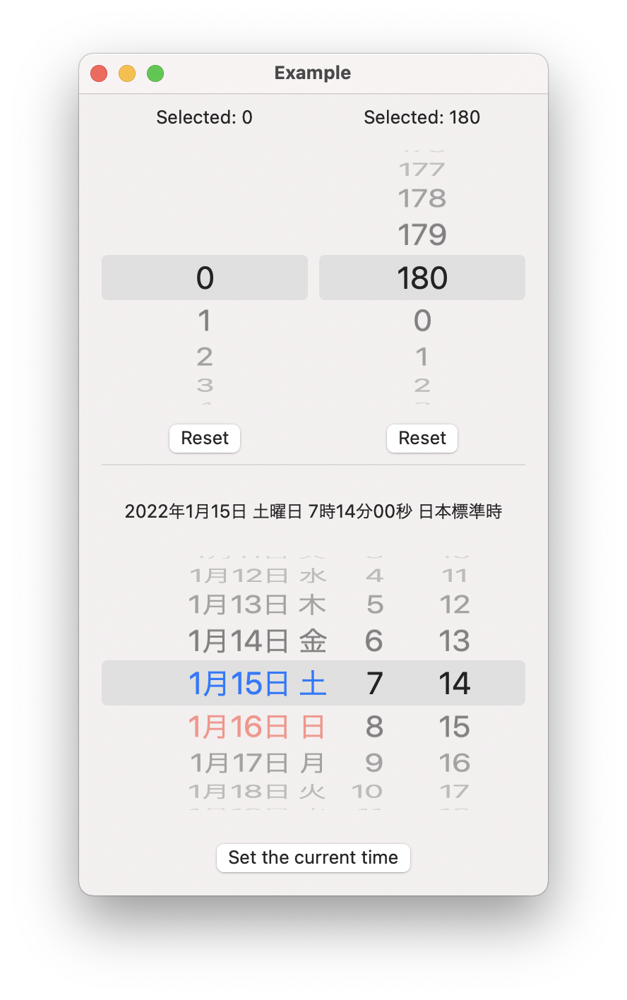

# WheelPicker

<p align="left">
<a href="https://travis-ci.org/tokiensis/WheelPicker"></a>


<a href="https://developer.apple.com/swift"></a>
<a href="https://github.com/Carthage/Carthage"></a>
<a href="https://cocoapods.org/pods/XLActionController"></a>
<a href="https://raw.githubusercontent.com/tokiensis/WheelPicker/master/LICENSE"></a>
</p>

## Introduction

WheelPicker is ...

* Pure-SwiftUI picker like iOS standard wheel style picker
  * No UIKit views are used internally, so it works smoothly with animated SwiftUI views.
  * You can also add it to macOS projects.
* Various selection styles are available
  * Circular style
  * Finite style
  * Infinite style (ex. used to select a date)
* Custumizable item label
  * Formatting display text as you like
  * Changing text color, font, or size
  * Complex labels with Image, Shape, etc...

 

## Usage

```swift
import WheelPicker
// ...
```

## Requirements

* iOS 14.0+
* macOS 11.0+
* Xcode 12.0+

## Getting involved

* If you **want to contribute** please feel free to **submit pull requests**.
* If you **have a feature request** please **open an issue**.
* If you **found a bug** or **need help** please **check older issues, [FAQ](#faq) and threads on [StackOverflow](http://stackoverflow.com/questions/tagged/WheelPicker) (Tag 'WheelPicker') before submitting an issue**.

Before contribute check the [CONTRIBUTING](https://github.com/tokiensis/WheelPicker/blob/master/CONTRIBUTING.md) file for more info.

## Examples

Follow these 3 steps to run Example project: clone WheelPicker repository, open WheelPicker workspace and run the *Example* project.

## Installation

### SwiftPM

```
https://github.com/tokiensis/WheelPicker.git
```

### CocoaPods

```ruby
pod 'WheelPicker', '~> 1.0.0'
```

### Carthage

```ogdl
github "tokiensis/WheelPicker" ~> 1.0.0
```

## Author

* [tokiensis](https://github.com/tokiensis) ([Wataku-City](http://wataku-city.com/software/))

## FAQ

### How to .....

You can do it by conforming to .....

# Changelog

See [CHANGELOG](CHANGELOG.md).
